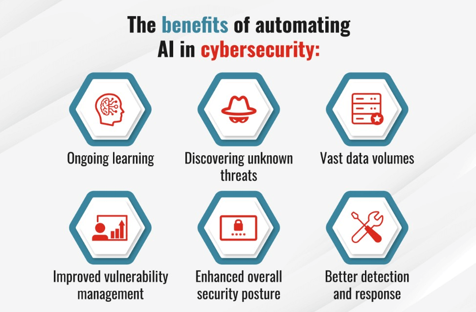

# AI-in-Cybersecurity
<b>How AI Integrated Cyber Security Shaping the Future?<b>

Every organization wants a robust security system and infrastructure to secure its future. Now, AI has become an undividable part of a sophisticated cybersecurity strategy.

Here are the 5 key takeaways that tell us how artificial intelligence in cybersecurity

1. The biggest benefit of AI is that it uses automation in cybersecurity. As a result, it becomes easier to handle the routine tasks of the cybersecurity department in every industry.

2. The AI capabilities reduce human errors. Thus, implementing AI technologies in manual and semi-manual workflows can improve accuracy, reduce inconsistencies, and save more time.

3. As AI can predict cyber-attacks, detect malicious activities, and generate alerts for security teams, most countries are using it to enhance security layers in the government and defense sectors to safeguard against possible attacks.

4. Artificial intelligence in cybersecurity will increase the demand for skilled professionals who can handle and manage AI systems in the cybersecurity domain.

5. The demand for Artificial Intelligence in cybersecurity has doubled in recent years. Thus, cybersecurity professionals should explore more cases of AI use in the field.

